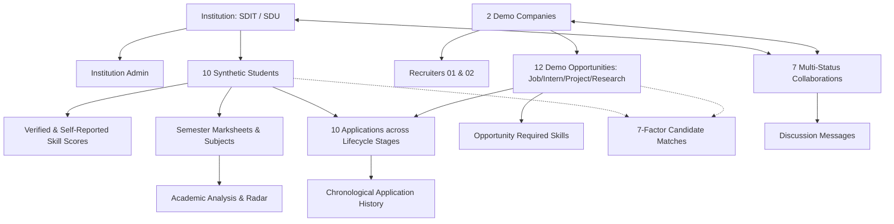

# SkillBridge Evaluator Demo Dataset Documentation

> [!NOTE]
> **Synthetic Evaluator Dataset**: All names, email addresses, affiliations, phone numbers, and profile details in this dataset are 100% synthetic mock identities designed exclusively for platform evaluation and automated testing.

---

## 1. Quick Start / Evaluator Credentials

All demo accounts share the single standardized evaluator password:

```text
Password: DemoPassword@123
```

### Evaluator Account Matrix

| Persona | Email Address | Display Name | Organization / Affiliation | Role | Primary Features to Test |
| :--- | :--- | :--- | :--- | :--- | :--- |
| **Institution Admin 01** | `demo.admin.01@skillbridge.demo` | Dr. Rajesh K. Demo | SkillBridge Demo Institute of Technology (`SDIT`) | `INSTITUTION_ADMIN` | Institutional Dashboard, Recruitment Metrics, Candidate Explorer, Endorsements, Skill Demand, Curriculum Alignment, Collaboration Hub, Compliance Reports |
| **Institution Admin 02** | `demo.admin.02@skillbridge.demo` | Prof. Sunita Sharma Demo | SkillBridge Demo University (`SDU`) | `INSTITUTION_ADMIN` | Multi-tenant isolation from SDIT, Partner Discovery, Saved Candidate Filters |
| **Recruiter 01** | `demo.recruiter.01@skillbridge.demo` | Vikram Malhotra Demo | SkillBridge Technologies Demo | `INDUSTRY` | Recruiter Dashboard, Candidate Explorer, 7-Factor Matches, Candidate Notes, Opportunity Lifecycle (Job, Internship, Project), Applications, Collaboration Hub |
| **Recruiter 02** | `demo.recruiter.02@skillbridge.demo` | Ananya Sen Demo | SkillBridge Analytics Demo | `INDUSTRY` | Multi-tenant isolation from Tech Demo, Campus Recruitment Drive, ML/Data Analyst Hiring Pipeline |
| **Student 01** | `demo.student.01@skillbridge.demo` | Aarav Sharma Demo | SDIT (Computer Science, 2026, 9.2 CGPA) | `STUDENT` | Student Dashboard, Skill Radar, Academic Performance & Roadmaps, Hired Status, In-App Notifications |
| **Student 02** | `demo.student.02@skillbridge.demo` | Diya Patel Demo | SDIT (Computer Science, 2026, 8.8 CGPA) | `STUDENT` | Full-Stack Skills, Verified Scores, Project Portfolio, Hired SWE Application |
| **Student 03** | `demo.student.03@skillbridge.demo` | Rohan Iyer Demo | SDIT (Data Science, 2025, 8.4 CGPA) | `STUDENT` | Data Analytics Skills, Active Interview Stage |
| **Student 04** | `demo.student.04@skillbridge.demo` | Kavya Nair Demo | SDIT (IT, 2026, 7.9 CGPA) | `STUDENT` | Cloud & DevOps Skills, Active Assessment Stage |
| **Student 05** | `demo.student.05@skillbridge.demo` | Arjun Mehta Demo | SDIT (Computer Science, 2027, 7.4 CGPA) | `STUDENT` | Shortlisted Stage, Frontend Profile |
| **Student 06** | `demo.student.06@skillbridge.demo` | Pooja Joshi Demo | SDU (Computer Science, 2025, 9.4 CGPA) | `STUDENT` | Top AI/NLP Researcher, Hired ML Engineer, SDU Tenant Boundary |
| **Student 07** | `demo.student.07@skillbridge.demo` | Siddharth Rao Demo | SDU (IT, 2026, 8.2 CGPA) | `STUDENT` | Full-Stack Web, Under Review Stage |
| **Student 08** | `demo.student.08@skillbridge.demo` | Sneha Kulkarni Demo | SDU (Cloud Computing, 2026, 8.6 CGPA) | `STUDENT` | Cloud Systems, Applied Stage |
| **Student 09** | `demo.student.09@skillbridge.demo` | Aditya Verma Demo | SDU (Design & Tech, 2027, 6.8 CGPA) | `STUDENT` | UI/UX Product Design, Rejected Stage |
| **Student 10** | `demo.student.10@skillbridge.demo` | Meera Menon Demo | SDU (Computer Science, 2026, 8.9 CGPA) | `STUDENT` | API Systems, Withdrawn Stage |

---

## 2. Seed and Management Commands

### Execute the Deterministic Seed
```bash
npm run seed:demo
```
- Completely idempotent and deterministic.
- Can be executed repeatedly without creating duplicates or mutating non-demo data.
- Automatically computes dynamic Academic Analysis, Candidate Matches, and Recruitment Metrics.

### Execute Surgical Cleanup (Optional)
```bash
npm run seed:demo:clean
```
- Selectively removes only demo entities created by `seed:demo`.
- Strictly preserves existing real data, the 410-row dataset, and the 2 preserved collaborations.

---

## 3. Dataset Interconnections & Architecture

The demo dataset establishes an interconnected web across the platform:



### Opportunity Type & Status Breakdown
The 12 seeded opportunities cover:
- **Types**: `JOB`, `INTERNSHIP`, `PROJECT`, `TRAINING`, `HACKATHON`, `RESEARCH`, `WORKSHOP`
- **Statuses**: `OPEN`, `PAUSED`, `CLOSED`
- **Work Modes**: `REMOTE`, `HYBRID`, `ON_SITE`

### Application Lifecycle Coverage
The seeded applications span all supported states:
- `hired`: 3 candidates hired across both companies (driving non-zero Recruitment Metrics)
- `interview`: Active interview stage with behavioral feedback
- `assessment`: Active technical assessment stage
- `shortlisted`: Selected for technical evaluation
- `under_review`: Application screened by recruiters
- `applied`: Initial application received
- `rejected`: Constructive rejection example
- `withdrawn`: Student withdrawal example

### Preserved Invariants
1. **Existing Collaborations Untouched**:
   - `53c9f6da-06b3-4416-bc9d-ba41364589be` (Distributed Cloud System Workshop, APPROVED, `institutionId: null`)
   - `1df54254-c05f-499b-833d-b27bb7461a06` (Distributed Cloud System Workshop, REQUESTED, `institutionId: null`)
2. **Benchmark & Multi-University Dataset Untouched**:
   - 410 records in `industryDemoCandidate`
   - 150 benchmark records in `academicSkillDataset` with `source = 'DEMO_DATASET'`
